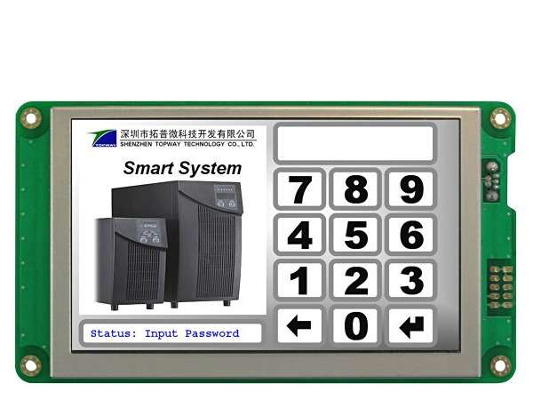

# HMI Touch Screens
Human Machine Interfaces.. For Devices. 
HMI Software Drivers to inteface Atmega32 MCUs with TopWay Touch Screens . using Atmel Studio IDE..

Note !!!!!!!!!!!
To know How to use the Dreiver Please Open Driver_User.h Or Driver_Post_configration.h Files.....

